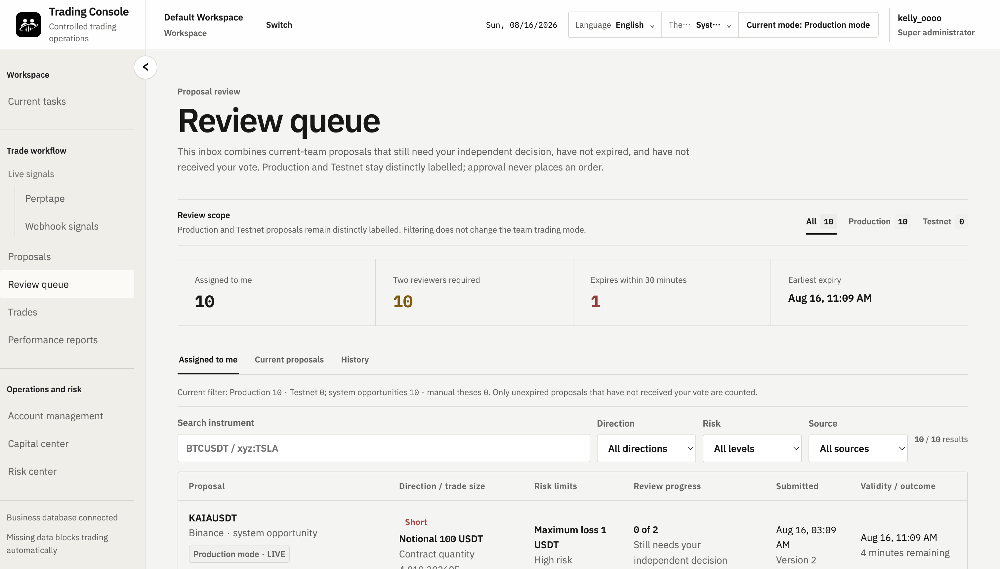
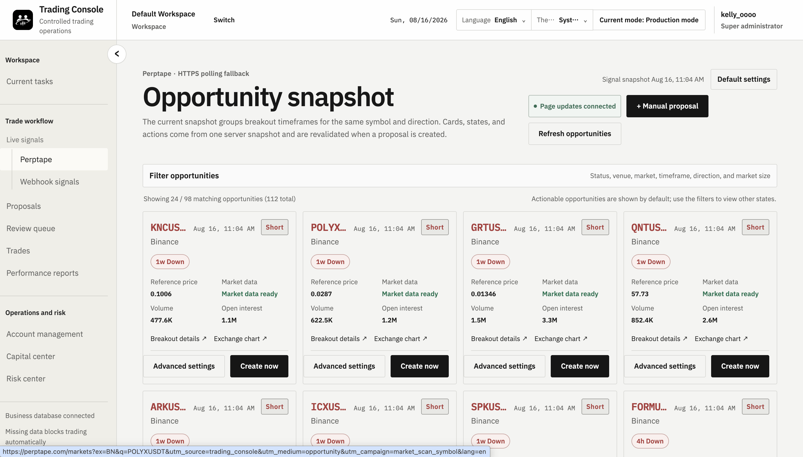
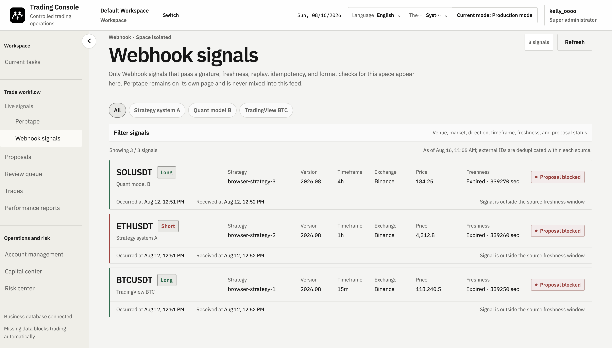
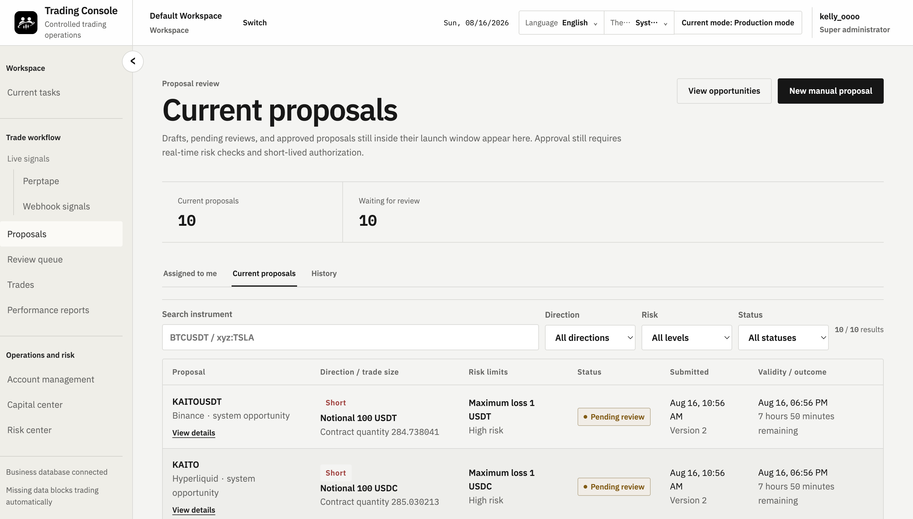
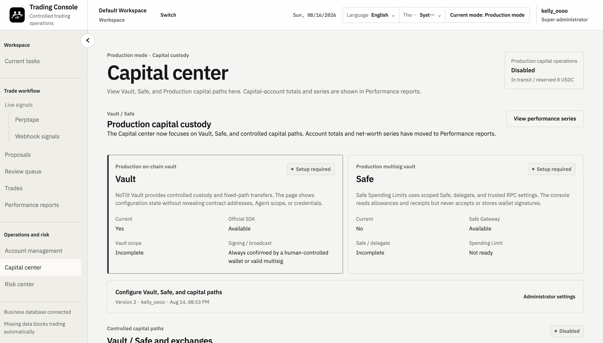

# TradeOps

**Control every trade before it reaches an exchange account.**

TradeOps is the open-source trading control layer between traders, trading bots,
AI agents, and exchange accounts. Apply the same policies, approvals, execution
controls, and audit trail to trades submitted by humans, bots, and AI agents.

[简体中文](README.zh-CN.md) · [Run locally](#run-locally) ·
[Documentation](docs/README.md) · [API quickstart](docs/API_QUICKSTART.md) ·
[Security](SECURITY.md)

> **Status: Alpha, self-hosted.** TESTNET and LIVE use the same proposal,
> review, risk, execution, reconciliation, and audit workflow. LIVE order send
> and every capital capability remain separately gated and disabled by default.



## The problem it solves

A working exchange connector and an experienced trader are not substitutes for
a permission system. Without a control layer:

- a trader can choose the wrong account, symbol, side, or amount;
- a manual order can exceed the team's approved risk budget;
- the submitter and reviewer may not be separated;
- manual and bot orders can compete for the same position or loss budget;
- an administrator may temporarily widen access without durable review;
- a retry can create a duplicate order; and
- an AI agent can request an abnormal position or leverage profile.

The same control path therefore applies to every actor who can request a trade.

TradeOps puts a server-enforced decision boundary between intent and the
exchange account:

1. A human, trading bot, or AI agent submits a trade proposal.
2. TradeOps freezes the material terms and checks workspace, team, account,
   environment, data freshness, and configured risk limits.
3. Deterministic policy selects a decision path: automatic approval when an
   explicit policy allows it, independent human review, or rejection. In the
   current Alpha release every executable proposal still requires independent
   human review; automatic approval is not yet enabled.
4. Approval creates short-lived, account-scoped authorization. Approval alone
   never sends an order.
5. An operator executes through the adapter for the proposal's fixed TESTNET or
   LIVE environment.
6. TradeOps reconciles the venue outcome and writes the proposal, decision,
   command, receipt, and exception path to the audit log.

```text
Trader / Trading Bot / Strategy Program / AI Agent
  -> Trade Proposal
  -> Deterministic Policy Check
  -> Auto Approve / Manual Approval / Reject
  -> Controlled Execution
  -> Exchange Reconciliation
  -> Audit Log
```

## Controls available now

- **Exact scope** — workspace, team, environment, venue, and account boundaries
  are checked server-side instead of trusted from the client.
- **Risk policy** — total, account, and single-trade risk limits; consecutive-loss
  cooldown; no-pyramid, reduce-only, pause, and kill-switch states.
- **Independent review** — versioned proposals, approve/reject decisions,
  no self-review, and expiring trading authorization.
- **Replay-safe execution** — idempotency, persistent capability gates, timeout
  handling, unknown-outcome recovery, cancel, sync, and reconciliation.
- **Fail-closed facts** — missing, stale, lost, incomplete, or rate-limited data
  is never treated as current data or silently replaced with zero.
- **Auditability** — actor, reason, scope, environment, decision, command, and
  execution outcome remain connected in durable records.

## People, bots, and agents

- Professional traders placing manual orders and running several trading bots.
- Small crypto trading teams with separate Trader, Reviewer, Risk Manager, and
  Administrator responsibilities.
- Market-making, arbitrage, quantitative, and automated trading teams.
- Developers connecting AI agents to exchange accounts without granting those
  agents unrestricted execution rights.

Every human, bot, strategy program, and AI agent should have its own identity,
permissions, risk limits, and audit record. A **Trader** submits manual or
strategy-assisted proposals; a **Reviewer** makes an independent decision; a
**Risk Manager** configures and responds to risk policy; an **Administrator**
manages membership and system scope without gaining an undocumented bypass.

API Keys belong to individual users, inherit current RBAC, and remain fixed to
one workspace and team. Neither a human nor an automated client may bypass
policy, approval, execution gates, or account scope.

## Current integrations

| Integration | Current status |
| --- | --- |
| Binance | TESTNET and LIVE adapter paths for account facts, order send/cancel, recovery, and reconciliation; credentials and LIVE gates are deployment-specific. |
| Hyperliquid | TESTNET and LIVE adapter paths for account facts, order send/cancel, recovery, and reconciliation; credentials and LIVE gates are deployment-specific. |
| Perptape | Configurable signal intake with freshness, normalization, and proposal revalidation. |
| Signed Webhook | Signature, nonce, replay, freshness, idempotency, and payload validation. |
| Telegram | Configurable team notification routes and a separate notification worker. |
| Bot / AI Agent API | User-owned API Keys and proposal-oriented access with server-side RBAC and scope checks. |
| Vault / Safe | Production capital-path configuration exists; signing, broadcast, and capital movement stay disabled until separately configured and enabled. |

The repository includes optional adapters for additional notification channels.
Formal engine contracts for Freqtrade, Hummingbot, NautilusTrader, and
QuantConnect LEAN remain roadmap work; they are not presented as supported
turnkey integrations today.

## Run locally

Requirements: Python 3.12+, [uv](https://docs.astral.sh/uv/), Docker, and Docker
Compose.

```bash
git clone https://github.com/nineheavens223-sys/TradeOps.git
cd TradeOps
cp .env.example .env.local
export TRADING_LOCAL_ADMIN_USERNAME=trading-admin
uv sync --frozen
./scripts/run_local.sh
```

Open <http://127.0.0.1:8014>. The generated local password is stored in
`.local/passwords/trading-admin` with mode `0600`; `.local/` is ignored by Git.
External integrations and dangerous capability gates remain off.

For an isolated Compose console with the read-only synchronization worker:

```bash
TRADING_PUBLIC_PORT=8022 ./scripts/run_compose.sh --runtime
```

The `--runtime` profile enables read-only fact synchronization. It does not
enable order send, capital movement, wallet signing, broadcast, or automation.

```bash
curl http://127.0.0.1:8014/health/live
curl http://127.0.0.1:8014/health/ready
open http://127.0.0.1:8014/openapi.json
```

Use [`docs/API_QUICKSTART.md`](docs/API_QUICKSTART.md) for bot/API onboarding.
The running `/openapi.json` document is the complete interface contract.

## Product tour

The screenshots below show current console workflows using local fixture data.
They are interface examples, not proof of production readiness or investment
results.

<table>
  <tr>
    <td></td>
    <td></td>
  </tr>
  <tr>
    <td></td>
    <td></td>
  </tr>
</table>

## What TradeOps is not

TradeOps is not a market-data terminal, charting tool, strategy backtester,
copy-trading service, signal marketplace, autonomous profit bot, custodian,
fund-management system, or investment adviser. It does not promise profit,
principal protection, or the prevention of every operational or trading loss.

A trading terminal answers **where to trade**. An execution algorithm optimizes
**how to trade**. A wallet permission system controls **who may move funds**.
TradeOps answers **whether a proposed trade is allowed, who must approve it,
which rule blocked it, and what actually happened at the exchange**.

It is intentionally narrower than end-to-end institutional platforms such as
Talos, Fireblocks, Elwood, or a fund PMS. See
[`docs/COMPETITIVE_POSITIONING.md`](docs/COMPETITIVE_POSITIONING.md).

## Deployment and trust boundaries

TradeOps is open source and designed for self-hosting. PostgreSQL is
authoritative for identity, role, proposal, review, authorization, gate,
receipt, and audit state. Exchange credentials are encrypted at rest and are
never returned by the API after submission. Trading does not require withdrawal
permission.

The current repository does **not** ship a separately packaged “Local Execution
Agent” whose local hard limits a remote control plane is technically incapable
of bypassing. Treat that model as a design direction, not a present guarantee.
Production readiness remains deployment-specific.

New installations keep these persistent capabilities `DISABLED`:

- `AUTO_ADD`
- `AUTO_OPERATING_REFILL`
- `AUTO_PROFIT_SWEEP`
- `CAPITAL_TRANSFER`
- `LIVE_ORDER_SEND`

A UI control, role name, environment label, process health check, or AI output
does not authorize an external effect. Review [`SECURITY.md`](SECURITY.md) and
[`docs/ARCHITECTURE.md`](docs/ARCHITECTURE.md) before configuring real accounts.

## Project and documentation

TradeOps is pre-1.0. Operators remain responsible for threat modeling,
provider configuration, monitoring, backups, incident response, legal duties,
and independent real-capital acceptance.

- [Documentation home](docs/README.md)
- [Operations console](docs/OPERATIONS_CONSOLE.md)
- [Architecture and invariants](docs/ARCHITECTURE.md)
- [Roadmap](ROADMAP.md)
- [Contributing](CONTRIBUTING.md)
- [Security policy](SECURITY.md)
- [Support](SUPPORT.md)

## License

TradeOps uses:

```text
GPL-3.0-only OR LicenseRef-TradingOPS-Commercial-1.0
```

The GPL option permits commercial use, modification, and distribution subject
to GPLv3. Parties that need closed-source integration, proprietary distribution,
or negotiated terms may obtain a separate commercial license.

Commercial licensing: `COMMERCIAL_EMAIL`

Private security reports: `SECURITY_EMAIL` or the repository's private security
advisory channel.

See [`LICENSE`](LICENSE), [`GPL-3.0-only`](LICENSES/GPL-3.0-only.txt), the
[commercial license reference](LICENSES/LicenseRef-TradingOPS-Commercial-1.0.txt),
and [`THIRD_PARTY_NOTICES.md`](THIRD_PARTY_NOTICES.md).
