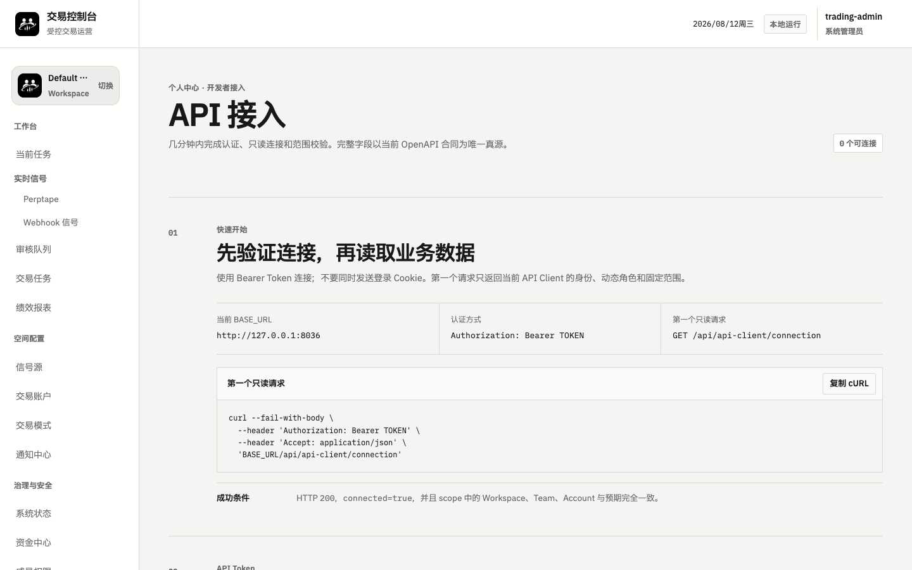

# TradingOPS

**Fail-closed 交易治理与运营控制平面**

[English](README.md) · [运营控制台说明](docs/OPERATIONS_CONSOLE.zh-CN.md) ·
[API 快速接入](docs/API_QUICKSTART.md) · [AI/API 中文指南](docs/AI_API_QUICKSTART.md) ·
[安全政策](SECURITY.md)

TradingOPS 位于策略引擎与真实执行之间，负责把候选交易意图转化为冻结提案、独立审核、有限授权、风险阻断、可审计执行与资金对账。

> 它不是策略市场、托管钱包、交易所或自动盈利系统。



## 核心流程

```text
策略或信号
  -> 来源与时效校验
  -> 冻结提案
  -> 独立审核
  -> 范围、风险与能力 Gate
  -> 幂等执行适配器
  -> 对账与审计证据
```

- **Workspace / Team 隔离**：成员、岗位、账户和业务数据由服务端按当前范围检查。
- **冻结提案**：审核前固定关键交易条款和版本。
- **独立审核**：提案发起人不能审核自己的提案。
- **Fail-closed 风险控制**：缺失、陈旧、丢失、不完整或限流数据不等于实时数据，也不等于零。
- **受控执行**：外部副作用必须同时通过进程开关、持久化 Gate、幂等和对账。
- **两种执行环境**：普通用户只可选择 TESTNET 测试模式与 LIVE 生产模式；
  `SETUP` 仅用于尚未完成配置的内部状态，已删除的 SHADOW 模拟系统不会作为回退路径。
- **HUMAN 所属 API Client**：Token 动态继承当前岗位，并固定在一个 Workspace、Team、Account 和 Venue。

## 五分钟安全启动

需要 Python 3.12+、[uv](https://docs.astral.sh/uv/)、Docker 与 Docker Compose。

```bash
git clone https://github.com/nineheavens223-sys/TradeOps.git
cd TradeOps
cp .env.example .env.local
export TRADING_LOCAL_ADMIN_USERNAME=trading-admin
uv sync --frozen
./scripts/run_local.sh
```

打开 <http://127.0.0.1:8014>。自动生成的本地密码保存在：

```text
.local/passwords/trading-admin
```

该目录不会进入 Git；外部集成、下单、资金、签名和广播默认关闭。新用户应先使用只读数据或经过验证的交易所 TESTNET 凭据。

需要在独立 Compose 控制台中同时启动只读同步 Worker 时，可运行：

```bash
TRADING_PUBLIC_PORT=8022 ./scripts/run_compose.sh --runtime
```

控制台地址为 <http://127.0.0.1:8022>。`--runtime` 只开启只读事实同步，不会开启
下单、资金划转、签名、广播或自动化 Gate。

```bash
curl http://127.0.0.1:8014/health/live
curl http://127.0.0.1:8014/health/ready
open http://127.0.0.1:8014/openapi.json
```

完整字段以运行中的 `/openapi.json` 为唯一真源。接入说明见
[`docs/API_QUICKSTART.md`](docs/API_QUICKSTART.md) 和
[`docs/AI_API_QUICKSTART.md`](docs/AI_API_QUICKSTART.md)。

当前页面职责、TESTNET/LIVE 模式、信号展示、账户生命周期、金库选择和绩效曲线
行为见 [`docs/OPERATIONS_CONSOLE.zh-CN.md`](docs/OPERATIONS_CONSOLE.zh-CN.md)。

## 产品边界与竞品关系

Freqtrade、Hummingbot、NautilusTrader 和 QuantConnect LEAN 主要覆盖策略、回测、组合、连接器或执行引擎，优先作为 TradingOPS 的集成生态。Fireblocks 与策略审批和资金治理部分重合，但同时提供钱包与密钥基础设施；TradingOPS 不托管密钥。Talos 是覆盖连接、执行、组合、结算和交易后流程的更完整机构平台，属于更直接的相邻竞品。

基于官方资料的完整比较见
[`docs/COMPETITIVE_POSITIONING.md`](docs/COMPETITIVE_POSITIONING.md)。

## 不可降低的安全边界

以下持久化能力在新安装中必须保持 `DISABLED`：

- `AUTO_ADD`
- `AUTO_OPERATING_REFILL`
- `AUTO_PROFIT_SWEEP`
- `CAPITAL_TRANSFER`
- `LIVE_ORDER_SEND`

页面按钮、岗位名称、AI Prompt、环境标签或进程健康都不能替代服务端授权。不得提交 `.env.local`、`.local/`、数据库转储、私有策略、真实账户或余额、原始日志和未脱敏截图。完整规则见 [`docs/PUBLICATION_BOUNDARY.md`](docs/PUBLICATION_BOUNDARY.md)。

## 成熟度

TradingOPS 当前为 **pre-1.0**。仓库已经包含 Workspace/Team 隔离、审核、风险、执行、资金、审计与 API Client 的测试基础，但任何真实资金生产就绪都取决于独立部署、配置、监控、备份、法律与安全验收。

## 许可证

```text
GPL-3.0-only OR LicenseRef-TradingOPS-Commercial-1.0
```

GPL 允许商业使用、修改和分发，但传播受覆盖作品时需要遵守 GPLv3 的源码与 copyleft 义务。需要闭源集成、专有分发或其他协商条款的用户可以选择单独商业许可证。

商业许可联系：`COMMERCIAL_EMAIL`。安全问题请通过 `SECURITY_EMAIL` 或仓库的私有安全公告渠道报告。

详见 [`LICENSE`](LICENSE)、[GPLv3 正文](LICENSES/GPL-3.0-only.txt)、
[商业许可证说明](LICENSES/LicenseRef-TradingOPS-Commercial-1.0.txt)、
[`CLA.md`](CLA.md) 与 [`THIRD_PARTY_NOTICES.md`](THIRD_PARTY_NOTICES.md)。
